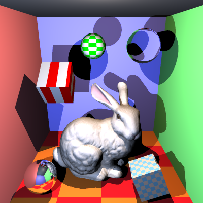
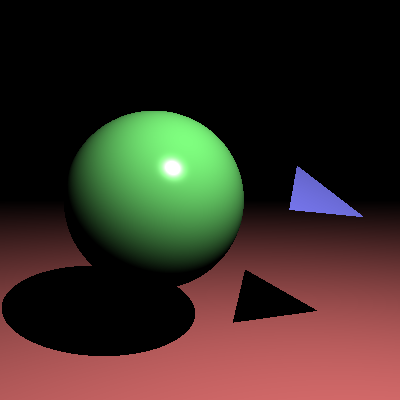

[](https://classroom.github.com/a/oMRiv2DB)
# COMP30019 - Project 1 - Ray Tracer

This is your README.md... you should write anything relevant to your
implementation here.

Please ensure your student details are specified below (*exactly* as on UniMelb
records):

**Name:** Hanyu Ji \
**Student Number:** 1400387 \
**Username:** EleanorJi \
**Email:** hanyuj2@student.unimelb.edu.au

## Completed stages

Tick the stages bellow that you have completed so we know what to mark (by
editing README.md). **At most 3** add-ons can be chosen for marking of stage three. If you complete more than this, pick your best one(s) to be marked, otherwise we will pick at random!

<!---
Tip: To tick, place an x between the square brackes [ ], like so: [x]
-->

##### Stage 1

- [x] Stage 1.1 - Familiarise yourself with the template
- [x] Stage 1.2 - Implement vector mathematics
- [x] Stage 1.3 - Fire a ray for each pixel
- [x] Stage 1.4 - Calculate ray-entity intersections
- [x] Stage 1.5 - Output primitives as solid colours

##### Stage 2

- [x] Stage 2.1 - Illumination
- [x] Stage 2.2 - Shadow rays
- [x] Stage 2.3 - Reflection rays
- [x] Stage 2.4 - Refraction rays
- [x] Stage 2.5 - The Whitted Illumination Model

##### Stage 3

- [x] Stage 3.1 - Advanced features
- [x] Stage 3.2 - Advanced add-ons
  - [x] A.1 - Anti-aliasing
  - [ ] A.2 - Soft shadows
  - [ ] A.3 - Depth of field blur
  - [ ] A.4 - Motion blur
  - [x] B.1 - Color texture mapping
  - [ ] B.2 - Bump or normal mapping
  - [x] B.3 - Procedural textures
  - [ ] C.1 - Simple animation
  - [ ] C.2 - Keyframe animation
  - [ ] C.3 - Camera animation

##### Description of Stage 3

**Stage 3.1:**

  **OBJ models:** At the beginning, I only identified the obj model and stored the required data into the corresponding list. Since the obj model is regarded as composed of triangles, the intersection detection calls the Intersect function of the triangles. However, I found that due to the presence of numerous unnecessary triangle intersection detections, it took a considerable amount of time, exceeding 30 minutes. So I looked up some open-source code on GitHub, and used the BVH node method to optimize this intersection detection(see Reference 1). Specifically, When loading the model, I organized all the triangles into a binary tree, and calculated the axis-aligned bounding box (AABB) that encloses all the triangles for each node. Then, based on the BVH construction strategy and after optimization, the longest axis among X, Y, and Z was randomly selected as the splitting axis. The triangles were sorted according to the coordinates of their centroids on this axis, and then divided into two subsets from the middle. When performing ray intersection, the first step is to conduct a quick detection against the bounding box of the node. If no intersection is found, the entire subtree is skipped, thereby avoiding unnecessary calculations for a large number of triangles. If a hit is achieved, recursively check the child nodes. Eventually, only the precise intersection with a few leaf nodes' triangles is required. This method optimizes the time complexity, significantly enhancing the rendering performance for complex models.

  **Custom camera:** When generating the ray, I map the pixel coordinates on the imaging plane to this camera local coordinate system. The final direction of the light ray is calculated by linearly combining the offsets of the right vector and the upper vector, thereby ensuring that all light rays are emitted from the camera position and propagate along the correct viewing direction. The conversion from the default position (0,0,0) to any custom camera position has been achieved.

**Stage3.2:**

  **Option A1 Anti-aliasing:** I use the Super-Sample Anti-Aliasing technique. Divide each pixel into an aaSamples × aaSamples grid evenly, and conduct precise sampling at the center of each sub-pixel. By calculating the coordinates of sub-pixels on the imaging plane and generating the corresponding light directions, ray tracing is performed separately for each sampling point and the color values are accumulated. Finally, the average value of all the sampling results is calculated as the final color of this pixel. Thus, through the averaging process of multiple samplings, the jagged phenomenon at the pixel edge is effectively smoothed, and a higher-quality rendering effect is achieved.

  **Option B1 Colour texture mapping:** I achieved the color texture mapping function by parsing the texture coordinate information in the OBJ file and mapping it to the texture image. Specifically, I expanded the parsing logic of the OBJ model, enabling it to recognize and store texture coordinates in a dedicated texture coordinate list. Meanwhile, when identifying the face informations, the texture coordinates corresponding to each vertex are passed to the Triangle for storage. To support texture queries, I override the GetDiffuseColor method of the TextureMaterial class, and then calculated the corresponding pixel position in the texture image based on the input texture coordinates. When calculating the intersection of light and triangles, the precise texture coordinates of the hit point are calculated through interpolation of the centroid coordinates, and these coordinates are then passed to the shading system. Eventually, a complete texture mapping process is achieved by sampling the texture image to determine the diffuse color of the object's surface.

  **Option B3 Procedural textures:** I extended the ProceduralMaterial class and rewrote its GetDiffuseColor method to support two modes(checkers & stripes). The repetition frequency of the pattern in the UV direction is controlled by the scaleU and scaleV parameters. Subsequently, the corresponding methods are called based on the specified pattern type. For the checkers pattern, two colors are alternately used by calculating the parity of the sum of the integerized U and V coordinates, resulting in an alternating grid pattern. For the stripes pattern, the color alternation is determined only based on the parity of the integerized U coordinate, resulting in a striped effect parallel to the V axis. Additionally, I enabled procedural textures on other entities by calculating appropriate UV coordinates at the intersection points(see Reference 2).

## Final scene render

Be sure to replace ```/images/final_scene.png``` with your final render so it
shows up here.



This render took **3** minutes and **33** seconds on my PC.

I used the following command to render the image exactly as shown:

```
dotnet run -- -f tests/final_scene.txt -o images/final_scene.png -x 3
```

## Sample outputs

We have provided you with some sample tests located at ```/tests/*```. So you
have some point of comparison, here are the outputs our ray tracer solution
produces for given command line inputs (for the first two stages, left and right
respectively):

###### Sample 1

```
dotnet run -- -f tests/sample_scene_1.txt -o images/sample_scene_1.png
```

<p float="left">
  
   
</p>

###### Sample 2

```
dotnet run -- -f tests/sample_scene_2.txt -o images/sample_scene_2.png
```

<p float="left">
  
   
</p>

## References

1. Reference for BVHnode construction code: https://github.com/heretique/raytracey/blob/master/BvhNode.h
2. Sphere mapping formula and theory: https://www.clicktorelease.com/blog/creating-spherical-environment-mapping-shader/

